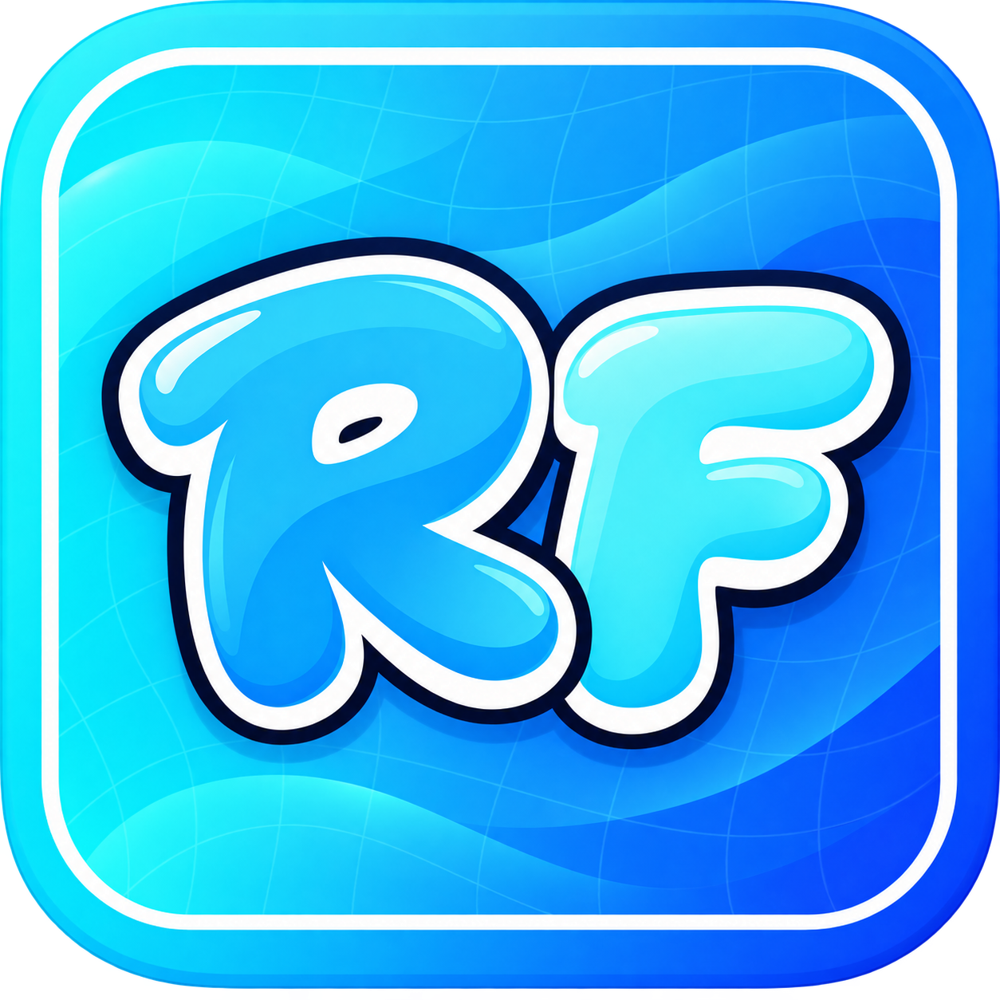

<p align="center">
  
</p>

<h1 align="center">React Fluid</h1>

<p align="center">Springs that keep their momentum. Paths that flow. Reveals that overlap.</p>

<p align="center">
  <a href="https://github.com/rbxrootx/react-fluid"></a>
  <a href="LICENSE.md"></a>
  <a href="https://github.com/rbxrootx/react-fluid/issues"></a>
</p>

React Fluid is a Luau animation library for Roblox React interfaces. It extends
[React Flow 0.5.0](https://github.com/OutOfBears/react-flow) with persistent motion
controllers, configurable springs, custom easing, continuous paths, staggered
reveals, and reusable collectible emitters. The original hooks remain available.

**Experimental source release.** There is no React Fluid Wally release yet.
Use the [installation guide](docs/installation.md) to install this fork.

[Get started](docs/installation.md) · [API guide](FLUID.md) ·
[Recipes](docs/recipes.md) · [Migration](docs/migration.md) ·
[Compatibility hooks](docs/legacy-api.md) · [Changelog](CHANGELOG.md)

## Motion that responds to input

One hook creates bindings and a controller. Update its targets in an effect or
event handler; spring retargets retain the current position and velocity.

```lua
local ReplicatedStorage = game:GetService("ReplicatedStorage")
local React = require(ReplicatedStorage.Packages.React)
local Fluid = require(ReplicatedStorage.Packages.ReactFluid)
local Tokens = Fluid.MotionTokens

local function AnimatedButton(props)
    local values, motion = Fluid.useMotion({ scale = 1 }, {
        reducedMotion = props.reducedMotion == true,
    })

    React.useEffect(function()
        motion:spring({ scale = if props.hovered then 1.06 else 1 }, Tokens.Spring.responsive)
    end, { props.hovered, motion })

    -- Pass values.scale to the UIScale inside your button primitive.
    return React.createElement(props.Button, {
        scale = values.scale,
        onActivated = props.onActivated,
    })
end

return AnimatedButton
```

The example expects your button primitive to accept a scale binding. Bindings
publish animated values directly; animation frames do not call React setState.
The hook stops its controller when the component unmounts.

## What is included

| API | Use it for |
| --- | --- |
| `useMotion` / `createMotion` | Persistent values, interruptible springs, impulses and completion |
| `motion:sequence` | Overlapping cues with explicit start offsets |
| `MotionTokens.Spring` | Seven presets, from gentle tracking to bouncy feedback |
| `SpringMath.physical` | Converting stiffness, damping and mass into spring settings |
| `Easing` | Polynomial, sine, exponential, circular, back, elastic and bounce curves; custom Bezier and steps |
| `stagger` | First, last, center or indexed origins with a capped start spread |
| `Reveal` / `useReveal` | Reversible clipped unfolds for tabs, cards and menus |
| `Path` | Quadratic/cubic Bezier curves, smooth splines and approximate constant-speed sampling |
| `createCollect` | Bounded, reusable coin and reward trails in Vector2 or Vector3 space |

The new controller supports **number, Vector2, Vector3, UDim, UDim2 and Color3**.
CFrame and the other upstream value types remain on the compatibility hooks.

## Pick the motion for the interaction

- **Hover, press, open, close:** use a spring so repeated input can retarget it.
- **A reveal with a fixed duration:** use `to` with an easing curve.
- **Coins flying to a counter:** use one continuous path through `createCollect`.
- **Tabs unfolding together:** use keyed reveal components with a bounded stagger.

Keep timing and spring settings in your application's motion tokens. Prefer a
small set of coherent presets over new tuning values at every call site.

## Used in BeeGame

BeeGame has adopted a pinned source snapshot of this fork for cash/honey pickup
flights, spring-driven windows and staggered shop reveals. Its existing ReactFlow
imports and new ReactFluid imports resolve to the same module. The new effects
read the game's Reduced Motion setting.

Integration is still being refined: arrival-pulse consistency and Reduced Motion
window closing have unresolved live checks. This is adoption evidence, not a claim
that every game integration case has passed validation.

## Performance and boundaries

The new runtime uses a dense active list, shared frame scheduling and in-place
numeric storage. It sleeps at rest and does not create a Promise or coroutine per
property or queued cue. Upstream 0.5.0 already pooled frame connections; existing
hooks retain that upstream engine.

A previously run scalar benchmark measured **3.306 ms/frame upstream versus
2.294 ms/frame Fluid** for 500 groups of six values on one development machine.
That is a limited CPU comparison, **not a measured game FPS improvement**.
See [performance notes and validation history](FLUID.md#runtime-and-performance).

Reveal is a 2D clipped unfold. Collectible targets are captured when emitted.
Eased retargets preserve position but restart the easing velocity curve; springs
are the choice for momentum-preserving interruption.

## Contributing and credits

See [CONTRIBUTING.md](CONTRIBUTING.md) for project structure and contribution
guidance. Report reproducible issues through [GitHub Issues](https://github.com/rbxrootx/react-fluid/issues).

React Fluid is maintained in the [rbxrootx fork](https://github.com/rbxrootx/react-fluid).
React Flow was created by [OutOfBears / Bear](https://github.com/OutOfBears), with
assistance from [GreenDeno](https://github.com/GreenDeno). Their work and the original
[MIT license](LICENSE.md) are retained. The new logo evolves the original RF identity;
see [branding notes](docs/branding.md).
